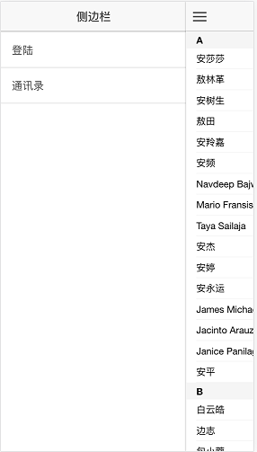
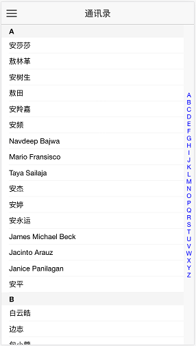

# 写一个简单的页面


* **1.** 用WebStorm ,Atom 或者其他编辑工具打开Demo

* **2.** 打开汉得指令库网站，选择第二个组件通讯录,点开源代码

http://mobile-app.hand-china.com/hand-directive/directive/index

* **3.** 在index.html 里面添加依赖包Jquery和CSS

```
在ionic.bundle.js前面添加jquery.min.js 并引入样式contract.css

<link href="css/contact.css" rel="stylesheet">

<script type="text/javascript" src="http://wechat.hand-china.com/hrmsstatic/hrmsV2PatchUpdate/ionic/jquery.min.js"></script>

<!-- ionic/angularjs js -->
<script src="lib/ionic/js/ionic.bundle.js"></script>

在body上面加上class 属性  ios 就是platform-ios android 就是 platform-android
<body ng-app="starter" class="platform-ios platform-cordova platform-webview">
```

* **4.** 在www/app.js 里面修改代码

```
.state('app.playlists', {
      url: '/playlists',
      views: {
        'menuContent': {
          templateUrl: 'templates/playlists.html',
          controller: 'testContactCtrl'
        }
      }
    })
```

* **5.** 在www/css 文件夹内新建 contact.css文件

```
.contactQuickContent::-webkit-scrollbar {
    display: none
    /* 隐藏滚动条，但依旧具备可以滚动的功能 */
  }

  .contactQuickContent::scrollbar {
    display: none
    /* 隐藏滚动条，但依旧具备可以滚动的功能 */
  }

  .contact-quick .contact-item .contact-header {
    padding-left: 15px;
    height: 25px;
    line-height: 25px;
    background: #f5f5f5;
    font-weight: bold; }

  .contact-quick .contact-item .contact-element {
    margin-left: 15px;
    padding-top: 5px;
    padding-bottom: 5px;
    border-bottom: 1px solid #f5f5f5; }
  .contact-quick .contact-item .contact-element span {
    padding-top: 5px;
    padding-bottom: 5px;
    border-bottom: 1px solid #f5f5f5;
    display: block; }
  .contact-quick .contact-item .contact-element .contact-element-value {
    padding-top: 5px;
    padding-bottom: 5px;
    border-bottom: 1px solid #f5f5f5; }

  .platform-ios .contact-quick-bar-header {
    position: fixed;
    top: 63.5px;
    padding-left: 15px;
    height: 25px;
    width: 100%;
    line-height: 25px;
    background: #f5f5f5;
    font-weight: bold; }

  .platform-android .contact-quick-bar-header {
    position: fixed;
    top: 44px;
    padding-left: 15px;
    height: 25px;
    width: 100%;
    line-height: 25px;
    background: #f5f5f5;
    font-weight: bold; }

  .contact-quick-bar-header {
    position: fixed;
    top: 44px;
    padding-left: 15px;
    height: 25px;
    width: 100%;
    line-height: 25px;
    background: #f5f5f5;
    font-weight: bold;
  }

  .contact-quick-bar {
    position: fixed;
    width: 20px;
    top: 44px;
    right: 0;
    background: #f8f8f8;
    height: 100%; }
  .contact-quick-bar .contact-quick-content {
    margin-top: calc(50vh - 230px);
    width: 16px;
    text-align: center;
    height: 416px; }
```

* **6.** 在www/templates/playlists.html 里面替换Html5代码和CSS

```
<ion-view view-title="通讯录" class="contact-quick">
  <ion-content delegate-handle="contactQuick"
               overflow-scroll="true"
               class="contactQuickContent"
               style="right:20px;overflowY:hidden">
    <div class="contact-list">
      <div class="contact-item" ng-repeat="item in list">
        <div class="contact-header" id="element{{item.header}}">
          {{item.header}}
        </div>
        <div class="contact-element" ng-repeat="element in item.elementList">
          {{element.element}}
        </div>
      </div>
    </div>
  </ion-content>
  <contact-quick-bar
    bar-element-size='12px'
    bar-element-color="blue"
    bar-background="#f8f8f8"
    show-Animate=true
    bar-element-height='14'>
  </contact-quick-bar>
</ion-view>
```

* **7.** 在www/controllers.js 里面编写JavaScript代码

```
.controller('testContactCtrl', [
    '$scope',
    '$rootScope',
    '$state',
    '$ionicHistory',
    '$ionicGesture',
    '$location',
    '$anchorScroll',
    '$timeout',
    'TestContactService',
    function ($scope,
              $rootScope,
              $state,
              $ionicHistory,
              $ionicGesture,
              $location,
              $anchorScroll,
              $timeout,
              TestContactService) {

      $scope.list = [];

      $scope.click = function (item) {
        console.log('testContactCtrl.$scope.click ...');
      };

      $timeout(function () {
        $scope.list = [
          {
            "header": "A",
            "elementList": [{"element": "安莎莎"}, {"element": "敖林革"}, {"element": "安树生"}, {"element": "敖田"}, {"element": "安羚嘉"}, {"element": "安频"}, {"element": "Navdeep Bajwa"}, {"element": "Mario Fransisco"}, {"element": "Taya Sailaja"}, {"element": "安杰"}, {"element": "安婷"}, {"element": "安永运"}, {"element": "James Michael Beck"}, {"element": "Jacinto Arauz"}, {"element": "Janice Panilagan"}, {"element": "安平"}]
          }, {
            "header": "B",
            "elementList": [{"element": "白云皓"}, {"element": "边志"}, {"element": "包小蓉"}, {"element": "白静"}, {"element": "包佳磊"}, {"element": "鲍天文"}, {"element": "柏智奥"}, {"element": "白平然"}, {"element": "边清"}, {"element": "鲍阳琼"}, {"element": "白禄"}, {"element": "包其远"}, {"element": "白钰"}, {"element": "鲍广伟"}, {"element": "鲍传琦"}, {"element": "毕永祥"}, {"element": "白丽丽"}, {"element": "鲍狄"}, {"element": "卜玉"}, {"element": "宾建武"}]
          }, {
            "header": "C",
            "elementList": [{"element": "陈仁斌"}, {"element": "沈婷婷"}, {"element": "陈肇仑"}, {"element": "陈瞻瞩"}, {"element": "陈颖"}, {"element": "蔡昕晖"}, {"element": "曹斯禺"}, {"element": "蔡松华"}, {"element": "程柯岚"}, {"element": "曾志强"}, {"element": "储凡"}, {"element": "蔡晓吉"}, {"element": "蔡文琪"}, {"element": "成淼"}, {"element": "迟磊"}, {"element": "陈一楠"}, {"element": "曹天"}, {"element": "蔡松"}, {"element": "陈勇"}, {"element": "崔蓉"}]
          }, {
            "header": "D",
            "elementList": [{"element": "戴时光"}, {"element": "丁白杨"}, {"element": "戴龙光"}, {"element": "段雪琨"}, {"element": "石咏"}, {"element": "邓琦"}, {"element": "石旭"}, {"element": "丁显宝"}, {"element": "邓丽林"}, {"element": "党拓"}, {"element": "杜鼎"}, {"element": "石立夫"}, {"element": "董伟"}, {"element": "单明月"}, {"element": "石飞"}, {"element": "翟婵"}, {"element": "戴征"}, {"element": "邓洋洋"}, {"element": "杜英东"}, {"element": "丁伟坚"}]
          }, {
            "header": "E",
            "elementList": [{"element": "Wendy Ho"}, {"element": "KERRY A GERMAINE"}, {"element": "Peng Haihong"}]
          }, {
            "header": "F",
            "elementList": [{"element": "方盈盈"}, {"element": "樊瑞瑞"}, {"element": "范鸣"}, {"element": "樊思兰"}, {"element": "付小狮"}, {"element": "附立江"}, {"element": "方勇超"}, {"element": "樊碧鹏"}, {"element": "傅勇"}, {"element": "范丽娜"}, {"element": "范建震"}, {"element": "方亮"}, {"element": "凡利恒"}, {"element": "范富强"}, {"element": "付浩"}, {"element": "付哲"}, {"element": "樊理想"}, {"element": "房坤"}, {"element": "房光耀"}, {"element": "樊彬"}]
          }, {
            "header": "G",
            "elementList": [{"element": "高莹"}, {"element": "郭飞"}, {"element": "高宇"}, {"element": "高旭东"}, {"element": "官琳琳"}, {"element": "高珊"}, {"element": "龚莉佳"}, {"element": "高熠"}, {"element": "郭星辰"}, {"element": "关珂"}, {"element": "郭曦"}, {"element": "顾筱凡"}, {"element": "高颂余"}, {"element": "高越"}, {"element": "龚幸"}, {"element": "郭凤霞"}, {"element": "郭夏"}, {"element": "郭忆"}, {"element": "葛瑞忠"}, {"element": "高志芳"}]
          }, {
            "header": "H",
            "elementList": [{"element": "胡娅男"}, {"element": "何立坚"}, {"element": "韩亮"}, {"element": "黄柏瑜"}, {"element": "郝良"}, {"element": "黄琳"}, {"element": "胡珍珍"}, {"element": "黄莉娟"}, {"element": "胡晓俊"}, {"element": "韩春丽"}, {"element": "何俊杰"}, {"element": "何明华"}, {"element": "黄斌"}, {"element": "贺斌"}, {"element": "何莎莎"}, {"element": "何青青"}, {"element": "胡志忠"}, {"element": "胡坚"}, {"element": "霍林鹏"}, {"element": "何亮"}]
          }, {
            "header": "I",
            "elementList": [{"element": "Lim Soo Sun"}, {"element": "Lim Johny Sulianto"}, {"element": "Hitesh Kumar"}, {"element": "William T Fontaine"}, {"element": "MICHAEL J ALLEN"}, {"element": "SIDDAVATAM VENKATA"}]
          }, {
            "header": "J",
            "elementList": [{"element": "巨敦航"}, {"element": "蒋治"}, {"element": "蒋院东"}, {"element": "姜蓓蓓"}, {"element": "嵇笑顺"}, {"element": "江季洲"}, {"element": "冀北"}, {"element": "姜丽波"}, {"element": "金青"}, {"element": "季思诗"}, {"element": "姜晓晖"}, {"element": "姜峰"}, {"element": "贾伟波"}, {"element": "江磊"}, {"element": "蒋嘉德"}, {"element": "金英花"}, {"element": "贾宇靓"}, {"element": "姜筱娇"}, {"element": "贾伟"}, {"element": "金威"}]
          }, {
            "header": "K",
            "elementList": [{"element": "孔维雅"}, {"element": "柯林峰"}, {"element": "康镜清"}, {"element": "孔金"}, {"element": "可欢"}, {"element": "柯昌署"}, {"element": "孔平"}, {"element": "柯盛帆"}, {"element": "邝镇江"}, {"element": "康怿恺"}, {"element": "康丽娟"}, {"element": "蒯庭君"}, {"element": "柯林"}, {"element": "匡文博"}, {"element": "孔燕燕"}, {"element": "柯宝泉"}, {"element": "旷甘"}, {"element": "康文英"}, {"element": "柯宁"}, {"element": "哈超凡"}]
          }, {
            "header": "L",
            "elementList": [{"element": "林淑婷"}, {"element": "刘晓南"}, {"element": "李义"}, {"element": "罗天翼"}, {"element": "李良"}, {"element": "李洋州"}, {"element": "赖嘉豪"}, {"element": "卢润秋"}, {"element": "李雪雪"}, {"element": "李慧敏"}, {"element": "李栋"}, {"element": "刘海洋"}, {"element": "梁建鑫"}, {"element": "李玲"}, {"element": "梁海华"}, {"element": "刘世威"}, {"element": "罗利民"}, {"element": "李丹"}, {"element": "卢炳杉"}, {"element": "李赛莹"}]
          }, {
            "header": "M",
            "elementList": [{"element": "缪晓巍"}, {"element": "马一月"}, {"element": "孟欣"}, {"element": "孟蕊"}, {"element": "马琛"}, {"element": "莫洋洋"}, {"element": "苗杰"}, {"element": "马伟"}, {"element": "马永军"}, {"element": "马伟佳"}, {"element": "梅倩"}, {"element": "马闻烽"}, {"element": "马超超"}, {"element": "马亮"}, {"element": "冒海琳"}, {"element": "万焘"}, {"element": "马轩"}, {"element": "马琴"}, {"element": "孟辉"}, {"element": "马宁"}]
          }, {
            "header": "N",
            "elementList": [{"element": "牛新宇"}, {"element": "倪同文"}, {"element": "牛骄"}, {"element": "倪智明"}, {"element": "宁文"}, {"element": "宁鸿儒"}, {"element": "倪剑平"}, {"element": "聂小敏"}, {"element": "宁万军"}, {"element": "牛佳庆"}, {"element": "牛帅隆"}, {"element": "倪文杰"}, {"element": "倪勤"}, {"element": "倪云云"}, {"element": "宁洋"}, {"element": "宁娅兴"}, {"element": "牛永杰"}, {"element": "倪伟"}, {"element": "聂兰华"}, {"element": "倪一鸣"}]
          }, {
            "header": "O",
            "elementList": [{"element": "欧阳慧"}, {"element": "欧阳高晖"}, {"element": "欧阳振强"}, {"element": "欧扬帆"}, {"element": "欧秀松"}, {"element": "欧丽云"}, {"element": "欧明朗"}, {"element": "ROBERT KU"}, {"element": "欧阳运虎"}, {"element": "欧志伟"}, {"element": "RONG FENG"}]
          }, {
            "header": "P",
            "elementList": [{"element": "冯梦洁"}, {"element": "冯雪芬"}, {"element": "皮霞芬"}, {"element": "彭维海"}, {"element": "蒲翠"}, {"element": "庞叶松"}, {"element": "潘龙超"}, {"element": "彭祁石"}, {"element": "彭潇"}, {"element": "潘碧玲"}, {"element": "冯映森"}, {"element": "潘斯佳"}, {"element": "彭日安"}, {"element": "冯朋磊"}, {"element": "皮迎波"}, {"element": "彭煜"}, {"element": "潘立伟"}, {"element": "潘旸"}, {"element": "冯雪莹"}, {"element": "潘志猛"}]
          }, {
            "header": "Q",
            "elementList": [{"element": "邱仁皓"}, {"element": "秦晓晨"}, {"element": "权杏霞"}, {"element": "秦娇"}, {"element": "乔璐璐"}, {"element": "秦菲"}, {"element": "邱子芯"}, {"element": "钱晶"}, {"element": "钱方园"}, {"element": "邱晓星"}, {"element": "瞿达林"}, {"element": "乔发光"}, {"element": "权一鸣"}, {"element": "瞿传通"}, {"element": "钱磊"}, {"element": "钱科华"}, {"element": "钱守微"}, {"element": "邱博文"}, {"element": "邱欣焕"}, {"element": "乔康辉"}]
          }, {
            "header": "R",
            "elementList": [{"element": "茹小娟"}, {"element": "任月"}, {"element": "阮笛平"}, {"element": "阮国雄"}, {"element": "容锦俊"}, {"element": "阮帆"}, {"element": "饶峰"}, {"element": "任涛"}, {"element": "戎丽凌"}, {"element": "任晓旭"}, {"element": "阮朝"}, {"element": "冉龙梅"}, {"element": "任雅威"}, {"element": "饶亮"}, {"element": "任波"}, {"element": "饶慧杰"}, {"element": "荣婷"}, {"element": "阮亮"}, {"element": "任佳"}, {"element": "任军"}]
          },
          {
            "header": "S",
            "elementList": [{"element": "桑培培"}, {"element": "尚婷婷"}, {"element": "史娟"}, {"element": "孙树亮"}, {"element": "宋晓阳"}, {"element": "孙启洪"}, {"element": "俞阿深"}, {"element": "孙启明"}, {"element": "孙玉婷"}, {"element": "孙玮瑶"}, {"element": "苏禄强"}, {"element": "宋波"}, {"element": "舒笑"}, {"element": "孙家宝"}, {"element": "孙玺"}, {"element": "史书友"}, {"element": "宋永祥"}, {"element": "邵成"}, {"element": "宋亮亮"}, {"element": "孙堉澍"}]
          },
          {
            "header": "T",
            "elementList": [{"element": "唐可慧"}, {"element": "余东阳"}, {"element": "滕思琦"}, {"element": "唐凯"}, {"element": "唐小艳"}, {"element": "谈树根"}, {"element": "唐润宇"}, {"element": "余玮晔"}, {"element": "田曲"}, {"element": "覃智麟"}, {"element": "佟佳仁"}, {"element": "唐棠"}, {"element": "陶欣语"}, {"element": "余洋"}, {"element": "仝笑语"}, {"element": "谭加伟"}, {"element": "余睿"}, {"element": "田红星"}, {"element": "唐稳舟"}, {"element": "余仕良"}]
          },
          {"header": "U", "elementList": [{"element": "Mustikadi Tunjung"}]},
          {
            "header": "V",
            "elementList": [{"element": "唐可慧"}, {"element": "余东阳"}, {"element": "滕思琦"}, {"element": "唐凯"}, {"element": "唐小艳"}, {"element": "谈树根"}, {"element": "唐润宇"}, {"element": "余玮晔"}, {"element": "田曲"}, {"element": "覃智麟"}, {"element": "佟佳仁"}, {"element": "唐棠"}, {"element": "陶欣语"}, {"element": "余洋"}, {"element": "仝笑语"}, {"element": "谭加伟"}, {"element": "余睿"}, {"element": "田红星"}, {"element": "唐稳舟"}, {"element": "余仕良"}]
          }, {
            "header": "W",
            "elementList": [{"element": "王盼"}, {"element": "王欢"}, {"element": "吴川"}, {"element": "伍国庆"}, {"element": "王晓睿"}, {"element": "王玮"}, {"element": "吴志鹏"}, {"element": "武小霞"}, {"element": "王晓宇"}, {"element": "王梦"}, {"element": "王勇勤"}, {"element": "王玲"}, {"element": "王科"}, {"element": "王多镜"}, {"element": "温伙兵"}, {"element": "王鸿雁"}, {"element": "王倩"}, {"element": "王菁"}, {"element": "武雨桐"}, {"element": "王丽娜"}]
          }, {
            "header": "X",
            "elementList": [{"element": "叶忠伟"}, {"element": "徐君"}, {"element": "徐畅"}, {"element": "肖宇"}, {"element": "许海兰"}, {"element": "谢钦元"}, {"element": "徐俊"}, {"element": "徐俊凯"}, {"element": "肖肖"}, {"element": "徐侃"}, {"element": "谢思涵"}, {"element": "徐超梁"}, {"element": "徐豪"}, {"element": "许凯迪"}, {"element": "徐宇宾"}, {"element": "徐立忠"}, {"element": "谢逸杰"}, {"element": "谢伟"}, {"element": "熊养彬"}, {"element": "谢禛榕"}]
          }, {
            "header": "Y",
            "elementList": [{"element": "于宝良"}, {"element": "于琳"}, {"element": "杨洋"}, {"element": "袁学松"}, {"element": "杨静"}, {"element": "印权"}, {"element": "谷甘霖"}, {"element": "杨满芝"}, {"element": "银娜"}, {"element": "苑中文"}, {"element": "杨柳"}, {"element": "于安琪"}, {"element": "姚秋皎"}, {"element": "杨子成"}, {"element": "杨莹"}, {"element": "喻少东"}, {"element": "姚璐"}, {"element": "袁永鑫"}, {"element": "袁健楠"}, {"element": "杨艺明"}]
          }, {
            "header": "Z",
            "elementList": [{"element": "赵超"}, {"element": "张贻旭"}, {"element": "张琛"}, {"element": "赵倩"}, {"element": "周建华"}, {"element": "朱卫强"}, {"element": "朱强"}, {"element": "周小青"}, {"element": "赵春"}, {"element": "朱俊雅"}, {"element": "张明晖"}, {"element": "张牧"}, {"element": "钟小园"}, {"element": "张震"}, {"element": "张婷茹"}, {"element": "赵梦红"}, {"element": "张文苑"}, {"element": "张文俊"}, {"element": "左文文"}, {"element": "周彤"}]
          }];
      }, 300);
    }])
  .service('TestContactService',
    function () {

      var elementList = [
        'A', 'B', 'C', 'D', 'E', 'F', 'G', 'H', 'I', 'J', 'K', 'L', 'M',
        'N', 'O', 'P', 'Q', 'R', 'S', 'T', 'U', 'V', 'W', 'X', 'Y', 'Z'
      ];

      this.generateContactList = function (contactList) {
        var list = {};
        var result = [];
        angular.forEach(elementList, function (data) {
          list[data] = [];
        });

        angular.forEach(contactList.rows, function (data1) {
          //console.log('data1 ' + angular.toJson(data1))
          if (!list[data1.pinYinC] || list[data1.pinYinC].length < 20) {
            if (list[data1.pinYinC]) {
              list[data1.pinYinC].push({
                "element": data1.name
              })
            } else {
              list[data1.pinYinC] = [{
                "element": data1.name
              }]
            }
          }
        });

        angular.forEach(elementList, function (data2) {
          var item = {
            "header": data2,
            "elementList": list[data2]
          };
          result.push(item);
        });

        return result;
      }
    })

  .directive('contactQuickBar', function () {
      return {
        restrict: 'E',
        replace: true,
        require: ['contactQuickBar'],
        controller: 'contactQuickBarCtrl',
        template: '<div><div class="contact-quick-bar-header" ng-if="showHeaderFlag" ng-bind-html="contactHeaderItem"></div>' +
        '<div class="contact-quick-bar" ng-style="quickBarStyle">' +
        '<div class="contact-quick-content" id="contactQuickHandle" ng-style="quickContentStyle">' +
        '<div ng-repeat="item in quickSearchBar" ng-style="item.style">' +
        '<div ng-bind="item.element" ng-click="contactQuick(item.element)">' +
        '</div>' +
        '</div>' +
        '</div>' +
        '</div></div>',
        link: function ($scope, $element, $attrs, ctrls) {

          var contactCtrl = ctrls[0];
          console.log(typeof(angular.element('#contactQuickHandle')));
          console.log(angular.element('#contactQuickHandle'));
          console.log(angular.element('#contactQuickHandle')[0].offsetTop);
          console.log(angular.element('#contactQuickHandle')[0].offsetHeight);

          var offsetTop = angular.element('#contactQuickHandle')[0].offsetTop;
          contactCtrl.init(offsetTop);
        }
      }
    }
  )
  .controller('contactQuickBarCtrl', [
    '$scope',
    '$state',
    '$attrs',
    '$ionicBind',
    '$ionicGesture',
    '$location',
    '$anchorScroll',
    function ($scope,
              $state,
              $attrs,
              $ionicBind,
              $ionicGesture,
              $location,
              $anchorScroll) {
      var self = this;

      //字母检索栏的字母的默认大小
      var barDefaultElementSize = '12px';

      //字母检索栏的字母的默认颜色
      var barDefaultElementColor = 'blue';

      //字母检索栏的字母的默认占用高度
      var barDefaultElementHeight = 16;

      var touchDefaultOffset = 3;

      //字母检索栏的默认高度，后面可以根据屏幕尺寸设置自适应匹配
      var barDefaultHeight = barDefaultElementHeight * 26;

      //字母检索栏的默认背景颜色
      var barDefaultBackground = 'gray';

      //当前选中的字母
      var currentElement = '';

      //字母检索滑动动画的半径
      var roundRate = 9;

      var elementNum = 26;

      $scope.contactHeaderItem = '';

      $scope.showHeaderFlag = false;

      //字母检索滑动动画的偏移系数
      var offsetList = [
        1,
        0.97,
        0.94,
        0.9,
        0.826,
        0.749,
        0.67,
        0.559,
        0.38
      ];

      var elementBarTopHeight = 44;
      var barElementHeight;
      var touchOffset;

      //是否显示快速检索的动画
      var showAnimate;

      if (angular.isDefined($attrs.showAnimate) && $attrs.showAnimate == 'true') {
        showAnimate = true;
      } else {
        showAnimate = false;
      }

      if (!angular.isDefined($attrs.barElementSize) || $attrs.barElementSize === '') {
        $attrs.$set('barElementSize', barDefaultElementSize);
      }
      if (!angular.isDefined($attrs.barElementColor) || $attrs.barElementColor === '') {
        $attrs.$set('barElementColor', barDefaultElementColor);
      }
      if (!angular.isDefined($attrs.barElementHeight) || $attrs.barElementHeight === '') {
        $attrs.$set('barElementHeight', barDefaultElementHeight);
      }
      if (!angular.isDefined($attrs.barBackground) || $attrs.barBackground === '') {
        $attrs.$set('barBackground', barDefaultBackground);
      }
      if (!angular.isDefined($attrs.touchOffset) || $attrs.touchOffset === '') {
        $attrs.$set('touchOffset', touchDefaultOffset);
      }

      try {
        barElementHeight = parseInt($attrs.barElementHeight);
        if (barElementHeight > 20) {
          barElementHeight = barDefaultElementHeight;
          console.log('字符的高度不能超过20');
        }
      }
      catch (e) {
        console.log('字符的高度必须为数字');
        barElementHeight = barDefaultElementHeight;
      }

      try {
        touchOffset = parseInt($attrs.touchOffset);
        if (touchOffset < 1 || touchOffset >= $attrs.barElementHeight) {
          touchOffset = barDefaultElementHeight;
          console.log('字符的高度不能超过20');
        }
      }
      catch (e) {
        console.log('字符的高度必须为数字');
        touchOffset = barDefaultElementHeight;
      }

      var barActualHeight = barDefaultHeight;

      var offsetTop = (parseInt($attrs.barHeight) + 44) / 2;

      if (ionic.Platform.isIOS()) {
        offsetTop = (parseInt($attrs.barHeight) + 64) / 2;
        //elementBarTopHeight = elementBarTopHeight + 24;
      }

      $scope.quickContentStyle = {
        "margin-top": "90px",
        "height": barActualHeight + "px"
      };

      $ionicBind($scope, $attrs, {
        $onElementClick: '&onElementClick',
        $onElementTouched: '&onElementTouched'
      });

      console.log('ctrl.barElementSize ' + $attrs.barElementSize);
      console.log('ctrl.barElementColor ' + $attrs.barElementColor);
      console.log('ctrl.barElementHeight ' + $attrs.barElementHeight);
      console.log('ctrl.barBackground ' + $attrs.barBackground);
      console.log('ctrl.showAnimate ' + showAnimate);

      //快速检索条
      $scope.quickSearchBar = [];

      $scope.elementList = [
        'A', 'B', 'C', 'D', 'E', 'F', 'G', 'H', 'I', 'J', 'K', 'L', 'M',
        'N', 'O', 'P', 'Q', 'R', 'S', 'T', 'U', 'V', 'W', 'X', 'Y', 'Z'
      ];

      //初始化数据
      self.init = function (offsetTop) {

        console.log('contactQuickBarCtrl.init offsetTop ' + offsetTop);

        angular.forEach($scope.elementList, function (data) {
          var item = {
            "element": data,
            "style": getElementStyle(0)
          };
          $scope.quickSearchBar.push(item);
        });

        barActualHeight = $attrs.barElementHeight * elementNum;
        var topHeightOffset = (barDefaultHeight - barActualHeight) / 2;

        var offset = offsetTop + topHeightOffset;

        elementBarTopHeight = elementBarTopHeight + offsetTop + topHeightOffset;

        console.log('contactQuickBarCtrl.init offset ' + offset);
        console.log('contactQuickBarCtrl.init elementBarTopHeight ' + elementBarTopHeight);

        $scope.quickContentStyle = {
          "margin-top": offset + "px",
          "width": 20 + "px",
          "height": barActualHeight + "px"
        };

        $scope.quickBarStyle = {
          "background": $attrs.barBackground
        }
      };

      $scope.contactQuick = function (item) {
        console.log('contactQuick...');
        if ($scope.$onElementClick) {
          $scope.$onElementClick();
        }


        //正式使用
        //$location.hash('element' + item);
        //$anchorScroll();
        //只是为了演示使用
        document.getElementById('element' + item).scrollIntoView();
      };

      var element = angular.element(document.querySelector('#contactQuickHandle'));

      function isLocateToElement(top, y, index) {
        /*console.log('isLocateToElement top ' + top);
         console.log('isLocateToElement y ' + y);
         console.log('isLocateToElement index ' + index);*/

        if (y > (top + (index) * $attrs.barElementHeight) + $attrs.touchOffset
          && y <= (top + (index + 1) * $attrs.barElementHeight) - $attrs.touchOffset) {
          return true;
        }
        return false;
      }

      function getElementStyle(offset, selectedFlag) {
        if (selectedFlag) {
          return {
            "color": $attrs.barElementColor,
            "font-size": '16px',
            "font-weight": "bold",
            //"border-radius": "8px",
            //"border": "1px solid #f5f5f5",
            "height": $attrs.barElementHeight + "px",
            "line-height": $attrs.barElementHeight + "px",
            "width": "20px",
            "margin-left": (0 - offset) + "px"
          };
        } else {
          return {
            "color": $attrs.barElementColor,
            "font-size": $attrs.barElementSize,
            "height": $attrs.barElementHeight + "px",
            "line-height": $attrs.barElementHeight + "px",
            "width": "20px",
            "margin-left": (0 - offset) + "px"
          };
        }
      }

      function animate(index, showAnimate) {
        angular.forEach($scope.quickSearchBar, function (data) {
          data.style = getElementStyle(0);
        });

        if (!showAnimate) {
          $scope.quickSearchBar[index].style = getElementStyle(0, true);
          return;
        }

        var offset;
        if (index < roundRate) {
          for (var i = 0; i < index + roundRate; i++) {
            offset = $attrs.barElementHeight * roundRate * offsetList[Math.abs(index - i)];
            $scope.quickSearchBar[i].style = getElementStyle(offset);
            if (i == index) {
              $scope.quickSearchBar[i].style = getElementStyle(offset, true);
            }
          }
        } else {
          for (var i = index - roundRate + 1; i < index + roundRate; i++) {
            offset = $attrs.barElementHeight * roundRate * offsetList[Math.abs(index - i)];
            if ($scope.quickSearchBar[i]) {
              $scope.quickSearchBar[i].style = getElementStyle(offset);
              if (i == index) {
                $scope.quickSearchBar[i].style = getElementStyle(offset, true);
              }
            }
          }
        }
      }

      function quickLocate(pageY) {
        for (var i = 0; i < elementNum; i++) {
          if (isLocateToElement(elementBarTopHeight, pageY, i)) {

            /*console.log('quickLocate elementBarTopHeight ' + elementBarTopHeight);
             console.log('quickLocate pageY ' + pageY);
             console.log('quickLocate i ' + i);
             console.log('quickLocate currentElement ' + currentElement);
             console.log('quickLocate $scope.elementList[i] ' + $scope.elementList[i]);*/

            if (currentElement === '' || currentElement != $scope.elementList[i]) {
              $scope.showHeaderFlag = true;
              currentElement = $scope.elementList[i];
              $scope.contactHeaderItem = $scope.elementList[i];
              animate(i, showAnimate);
              $scope.$apply();
              //正式使用
              //$location.hash('element' + $scope.elementList[i]);
              //$anchorScroll();
              //只是为了演示使用
              document.getElementById('element' + $scope.elementList[i]).scrollIntoView();
            }
          }
        }
      }

      /*$('#contactQuickHandle').addEventListener("touchmove",function(e){
       console.log('e.originalEvent.targetTouches[0].pageY' + e.e.touches[0].pageY);
       quickLocate(e.e.touches[0].pageY);
       });

       element.on('touchend',function(e) {
       $scope.showHeaderFlag = false;
       angular.forEach($scope.quickSearchBar, function (data) {
       data.style = getElementStyle(0);
       });
       $scope.$apply();
       });*/

      //拖拽标记TimeSheet具体天
      $ionicGesture.on("drag", function (e) {
        console.log('drag.screenY ' + e.gesture.touches[0].screenY);
        console.log('drag.pageY ' + e.gesture.touches[0].pageY);
        console.log('drag.clientY ' + e.gesture.touches[0].clientY);
        quickLocate(e.gesture.touches[0].pageY);
      }, element);

      //
      $ionicGesture.on("touch", function (e) {
        //$scope.contactHeaderItem = $scope.contactHeaderItem + '$scope.contactHeaderItem.touch ' + e.gesture.touches[0].pageY + '<br>';
        //quickLocate(e.gesture.touches[0].pageY);
      }, element);


      $ionicGesture.on("release", function (e) {
        //$scope.contactHeaderItem = $scope.contactHeaderItem + '$scope.contactHeaderItem.release ' + e.gesture.touches[0].pageY + '<br>';
        $scope.showHeaderFlag = false;
        angular.forEach($scope.quickSearchBar, function (data) {
          data.style = getElementStyle(0);
        });
        $scope.$apply();
      }, element);
    }])
```

* **8.** 在myApp目录下运行ionic serve 就能看到效果


