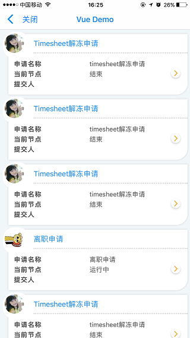

# 调用第三方业务接口

在刚才demo的基础上对接后台接口

* **1.** 单点登陆，使用第三方的登陆接口绑定到平台中，获取token，以便调用业务接口

```
let token = ''
let url = 'http://wechat.hand-china.com/hcrm_web/oauth/token?client_id=' +
          'd66ff5b1-6f50-4bb1-b4d3-6971b97775b7&client_secret=' +
          '780ea799-79b8-4597-a973-85de55c478d3&grant_type=password' +
          '&username=3705&password=123456&device_info=iOS';

  this.$http.post(url).then((response)=> {
   console.log(response)
   if (response.status == 200) {
     console.log(response.data.access_token)
     token = response.data.access_token;
     getData(this);
   }
  }).catch((error)=> {
  });
```

* **2.** 使用单点登陆获取的token,来对接业务接口

```
url = 'http://wechat.hand-china.com/hcrm_web/api/l/wfl_wx_workflow_appr/get_instance_list_v2'
let params = {
          params: {
            p_employee_code: "3705",
            p_flag: "Y",
            p_submitter_key: "",
            p_workflow_key: "",
            p_page: 1
          }
        };
        vm.$http.post(url, params, {
            headers: {'Content-Type': 'application/json', 'Authorization': 'Bearer ' + token}
          }
        ).then((response)=> {
          if (response.status == 200) {
            vm.isLoadingData = false;
            processTodoList(vm, response.data)
          }
        }).catch((error)=> {
        });
```


* **3.** 编写完代码以后，下面是运行效果

