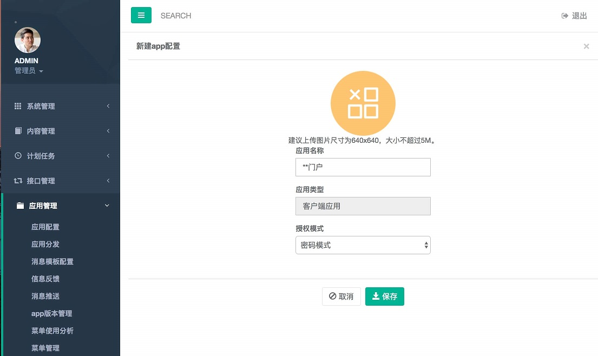

# 配置App和应用

* **1.** 登陆后台应用管理系统

`http://**IP+Port**/portal/#/login`

* **2.** 进入App配置界面，新建App

* **3.** 进入菜单配置界面，选择我们刚才新建的App应用，填写完基础信息，保存

* **4.** 进入菜单明细界面，新增应用版本和资源包代码(前面我们创建的Vue应用代码资源包demo.zip)，保存菜单明细

* **5.** 新建离线应用菜单完成，可以去App平台查看菜单